# 门禁分析软件包变更影响

## 一、需求概述：

### 1.1、需求背景：

当前openEuler社区代码合入机制为：提交软件包修改pr后，进行针对该软件包的规范检查，编译及安装检查，软件包变更检查，但其对其他包的影响范围不感知，常常出现修改合入到mainline工程之后才发现其影响一系列软件包编译或安装失败，然后需要投入人力去定位问题和解决问题。

为解决该问题，将问题拦截在pr合入之前，提高mainlin工程的稳定性和高可用性，在门禁检查中添加其影响范围的检查，并通过机制确保范围内软件包全部编译和安装成功之后再进行pr合入。

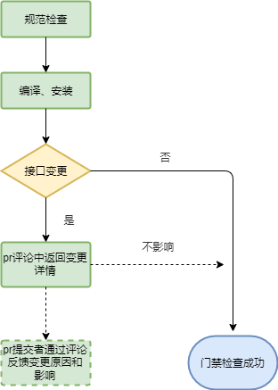

### 1.2、需求特性

| 特性编号 | 特性名称           | 特性描述                                                     | 备注                  | 责任人 |
| -------- | ------------------ | ------------------------------------------------------------ | --------------------- | ------ |
| 1        | 单包/多包编译      | 调用api创建测试环境（工程），支持软件包下载，上传，支持单包编译和多包并行编译，支持查询编译结果，记录编译日志。 |                       | 钰莹   |
| 2        | 单包/多包安装      | 本地进行单包安装和多包安装，输出安装结果和安装日志。         | 机制保证安装依赖新包  | 钰莹   |
| 3        | 软件包变更分析     | 使用oecp进行软件包变更检查，对变更内容进行分级，分析哪些是会影响其他软件包的变更，记录变更数据。 | 已有功能，需要适配    | 李海炜 |
| 4        | 软件包被依赖分析   | 分析变更软件包的一层被依赖软件包范围，区分编译依赖和安装依赖，记录数据上传文件服务器。 | 使用oecp和dnf         | 钰莹   |
| 5        | 软件包维护信息查找 | 查找受影响且编译/安装失败的软件包的维护信息。                | 依赖sig_info.yaml整改 | 鹏举   |
| 6        | 数据组装           | 单包/多包编译/安装结果，日志链接，软件包变更内容，被依赖数据，软件包维护信息，**自验证指导**，pr关联数据拼接，用于回显评论。 |                       | 李海炜 |
| 7        | pr关联             | pr间可能互相依赖新的软件包版本，需要将多个pr内容拉取到同一个测试工程中，工具需要识别/link xxx的评论内容，支持pr关联关系的验证、新增、删除、查询。 | 依赖jenkins任务       | 正堂   |
| 8        | pr合入限制         | 对于门禁失败pr和关联的pr，要做合入限制，保证合入后对工程影响最小化。工具需要提供关联pr的状态查询功能，供基础服务做合入限制；门禁失败的强制合入逻辑需要修改。 | 需要和基础服务协作    | 正堂   |

### 1.3、受益人

| 角色         | 角色描述                                                     |
| ------------ | ------------------------------------------------------------ |
| 社区开发者   | 参与社区软件包贡献的人员，能及时感知到软件包变化带来的影响，并能根据提供的测试工程去做影响消除。 |
| maintainer   | 负责看护某些软件包的sig组责任人，能及时感知到软件包变化带来的影响，将兼容性问题拦截在pr合入之前。 |
| 工程维护人员 | 负责OBS工程中软件包构建和版本构建的人员，减少流入OBS工程的问题数量，减轻维护压力。 |
| TC成员       | 通过门禁收集的变更数据和pr异常合入的数据，衡量sig组和maintainer的合入质量。 |

### 1.4、相关人

| 角色         | 角色描述                                                     |
| ------------ | ------------------------------------------------------------ |
| 门禁维护人员 | 负责日常运维openEuler社区门禁的人员，需要修改门禁流程，上传、展示门禁数据。 |
| 基础设施人员 | 新流程需要依赖基础设施人员提供更多的环境支持，以满足门禁运行时间要求。 |
| maintainer   | 需要明确关联pr的合入机制，保证只有当pr门禁通过时再合入。     |

## 二、需求分析

### 2.1、门禁新流程

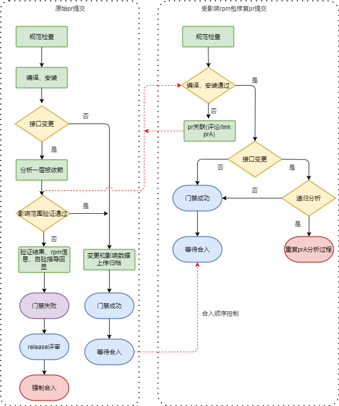

### 2.2、流程详解

#### 2.2.1、接口变更检查

使用oecp进行软件包变更检查，对具体变更内容进行分析分级，标识哪些变更可忽略，哪些变更可能会影响到其他软件包。

对可能会影响到其他软件包的变更进行下面进一步处理。

<table>
    <tr>
        <td>变更分类</td>
        <td>变更类型</td>
        <td>变更详情</td>
        <td>变更分级</td>
    </tr>
    <tr>
        <td rowspan="2">rpm包</td>
        <td>add</td>
        <td>xxx.rpm</td>
        <td>info</td>
    </tr>
    <tr>
        <td>update</td>
        <td>yyy.rpm</td>
        <td>warning</td>
    </tr>
        <tr>
        <td rowspan="2">配置文件</td>
        <td>add</td>
        <td>xxx.conf</td>
        <td>info</td>
    </tr>
    <tr>
        <td>delete</td>
        <td>yyy.conf</td>
        <td>warning</td>
    </tr>
    <tr>
        <td rowspan="2">组件</td>
        <td>add</td>
        <td>xxx.so</td>
        <td>info</td>
    </tr>
    <tr>
        <td>add</td>
        <td>yyy.so</td>
        <td>error</td>
    </tr>
</table>

#### 2.2.2、被依赖分析

通过oecp检查结果得出变更的组件/软件包（按照精度  接口>组件（库）>rpm包输出被依赖信息）

无法通过oecp工具反向查询被依赖范围的，使用dnf的命令 dnf repoquery --setopt=reposdir="repo-dir路径"  --whatdepends "xxx(组件/软件包名称)"  查询依赖该组件/软件包的其他rpm包。

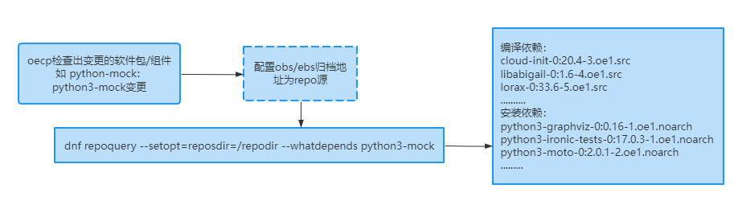

> 配置repo源时，需根据构建的环境（OBS、EBS），采用不同的归档地址，在使用dnf repoquery时，需指定配置的repo源。

#### 2.2.3、拉取影响范围内软件包

**OBS构建环境软件包拉取**

根据上一步分析出的依赖范围，使用POST /source/<project>/<package>?cmd=branch方式，将对应软件包拉取到一个测试工程中，使用obs进行编译验证。

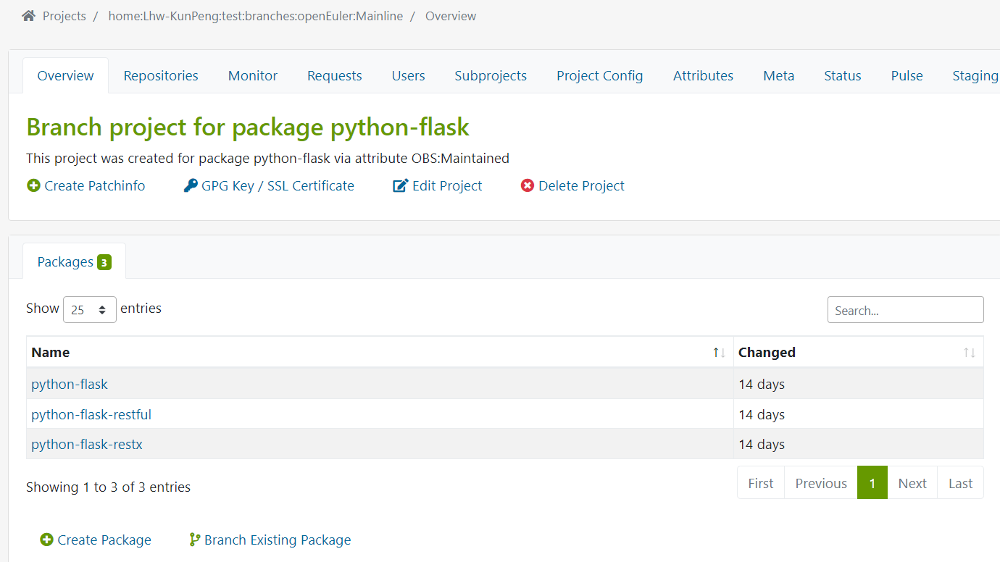

**EBS构建环境软件包拉取**

根据分析的依赖范围，可以通过 ccb update命令将对应的软件包上传至测试工程中，使用ebs进行编译验证

```shell
ccb update projects XXXXX --json  json文件
```

**json文件格式如下：**

> package_overrides字段：存在pr时，则添加package_overrides字段，不存在pr直接在my_specs+中添加数据

```json
{
    "my_specs+": [
        {
            "spec_name": "python-flit",
            "spec_url": "https://gitee.com/src-openeuler/python-flit.git",
            "spec_branch": "master"
        }
    ],
    "package_overrides": {
        "python-flit": {
            "pr_id": "6"
        }
    }
}
```

#### 2.2.4、影响范围内软件包编译、安装验证

**OBS软件包编译**

通过obs的api查询测试工程的编译状态，直至工程稳定（所有包都有编译结果）


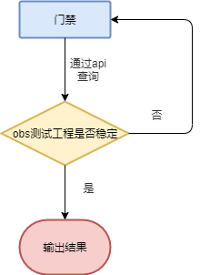

**EBS软件包编译**

通过ebs的ccb命令查询测试工程的编译状态（编译结果），每一次查询间隔10s，直至工程编译完成，输出编译结果

安装验证在门禁环境中进行安装验证，并记录安装日志存储到文件服务器。

#### 2.2.5、查找软件包维护人员

按照优先级 commitor>maintainer>贡献者 顺序查找编译或者安装失败的软件包维护人员信息。

#### 2.2.6、输出门禁结果

在之前门禁的返回结果基础上加上以下内容。

| 受影响软件包 | 验证内容 | 验证结果 | 验证详情                         | 维护人         |
| ------------ | -------- | -------- | -------------------------------- | -------------- |
| xxx          | 编译     | 失败     | obs测试工程中日志链接            | xxx@huawei.com |
| yyy          | 安装     | 失败     | 文件服务器或者数据库保存日志链接 | yyy@huawei.com |

#### 2.2.7、受影响软件包跟踪解决

**1、个人环境验证**

使用OSC或者rpmbuild验证。

**2、obs测试工程复制**

```
1、若没有OBS账号，需注册OBS账号。https://117.78.1.88/user/signup

2、使用OBS "账号:密码" 生成base64编码。可使用在线base64编码，例如：https://c.runoob.com/front-end/693/

3、通过从门禁创建的OBS测试工程拉取仓库的方式创建私人工程（建议使用未创建的工程，该方式会自动创建）
curl --location --request POST 'https://build.openeuler.org/source/{pr回显的OBS测试工程}/{pr对应的仓库名称}?cmd=branch&target_project={自己的私人工程名称}' \
--header 'Authorization: Basic {上面生成的base64编码}'

4、复制整个门禁创建的OBS测试工程到上面创建的私人工程
curl --location --request POST 'https://build.openeuler.org/source/{上面创建的自己的私人工程名称}?cmd=copy&oproject={pr回显的OBS测试工程}&nodelay=True' \
--header 'Authorization: Basic {上面生成的base64编码}'
```

**3、ebs测试工程验证**

```txt
1、 若没有ebs账号，需注册ebs 账号。 http://120.46.196.17/#/ ebs账号与gitee账号绑定 
2、 安装ebs 客户端，Gitee地址 https://gitee.com/openeuler-customization/lkp-tests 根据README.md 文件中的指导方式安装，并配置相关配置文件
3、 根据从门禁创建的EBS测试工程方式，使用EBS客户端命令创建工程，主要介绍ebs 客户端的命令使用（或使用网页端创建）
```

> 创建测试工程

```shell
ccb create projects  XXXXX  --json  json_path
```

**json文件格式如下：**

```json
{
    "spec_branch": "openEuler-22.09",
    "my_specs": [
        {
            "spec_name": "python-tornado",
            "spec_url": "https://gitee.com/src-openeuler/python-tornado.git"
        }
    ],
    "build_targets": [
        {
            "os_variant": "openEuler:22.09",
            "architecture": "aarch64"
        }
    ],
    "package_overrides": {
        "python-tornado": {
            "pr_id": "16"
        }
    }
}
```

#### 2.2.8、pr关联机制：

**原则：**

被影响的软件包去link源软件包。

**pr关联验证：**

当prB发起pr关联时，需要校验目标pr（prA）的开启状态，目标pr（prA）是否有影响到发起pr的软件包（rpmB）

**关联实际操作：**

**方案1——测试工程重用**

> 适用于**OBS**或**EBS**两种构建环境，处理逻辑一致

prB关联prA，prB的测试工程不再使用，直接使用prA的测试工程，将rpmB‘上传到prA的测试工程中进行编译验证。

优点：prB测试工程可以及时释放，节省资源。

缺点：prB重试时处理逻辑比较复杂，要识别关联关系来判断是重新拉取测试工程还是使用prA的测试工程。

**方案2——Repositories重用**

> Repositories重用方案暂只支持**OBS**构建环境

prB关联prA，prB的测试工程添加prA的Repositories，使用prA测试工程归档的rpmA'

优点：各个pr的测试工程隔离性较好，且不用判断初次提交还是重试操作。

缺点：各个pr的测试工程的生命周期和pr同步，存在时间长，资源占用较较方案一多。

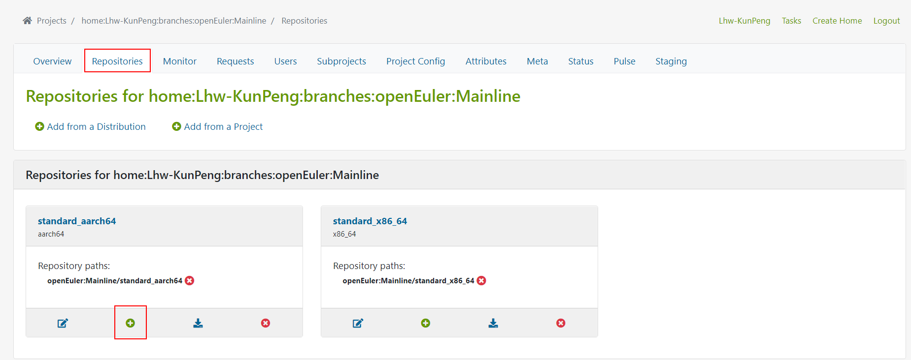

> **注意：** 当前门禁工具中需要同时支持OBS、EBS两种构建环境，为兼容性考虑，本工具中采用**方案一**进行pr关联

#### **2.2.9、pr合入机制：**

当关联的所有pr都门禁成功后，各自软件包maintainer可以先行评论/lgtm和/approve,若此时还有与其关联的pr没有评论/approve，那么将等待，直至最后一个关联的pr评论了/approve，所有pr将一起合入。

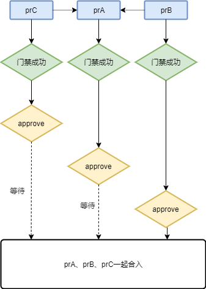


### 2.3、逻辑视图：

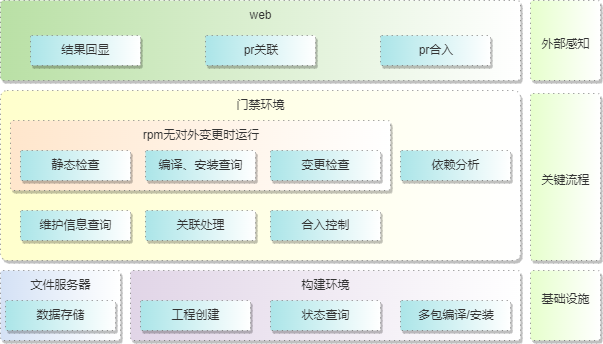


### 2.4、开发视图

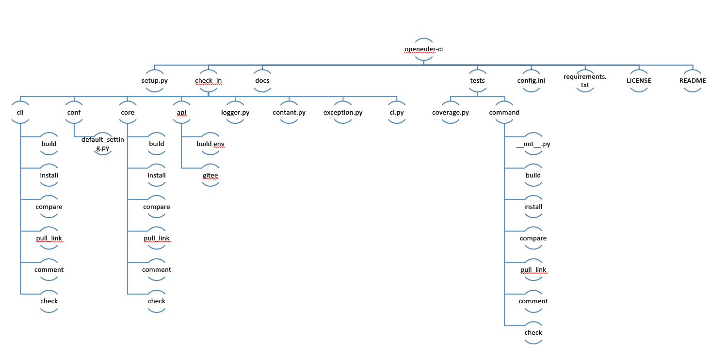

### 2.5、运行视图

#### 2.5.1、初始pr提交

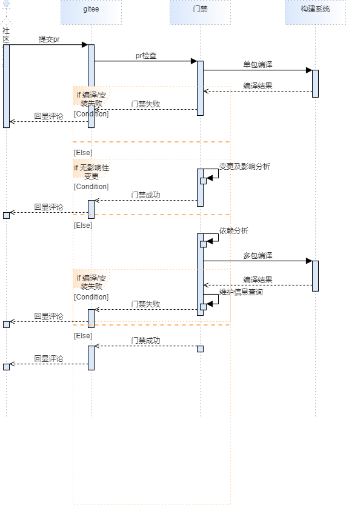

#### 2.5.2、修复pr提交

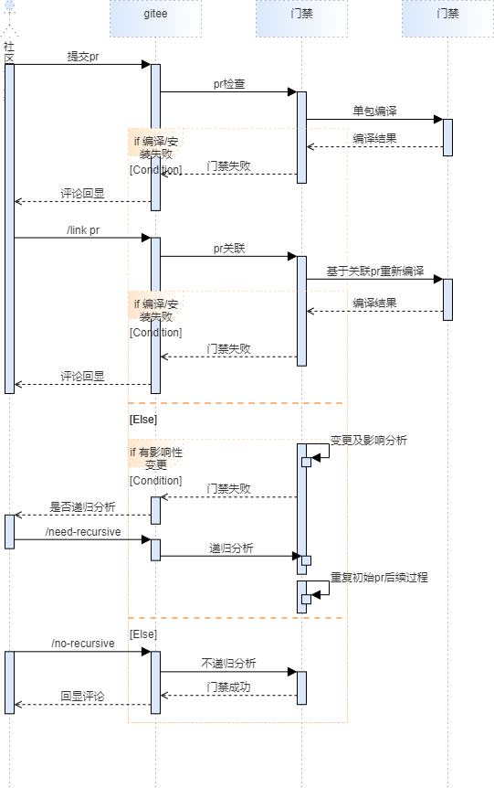

### 2.6、部署视图

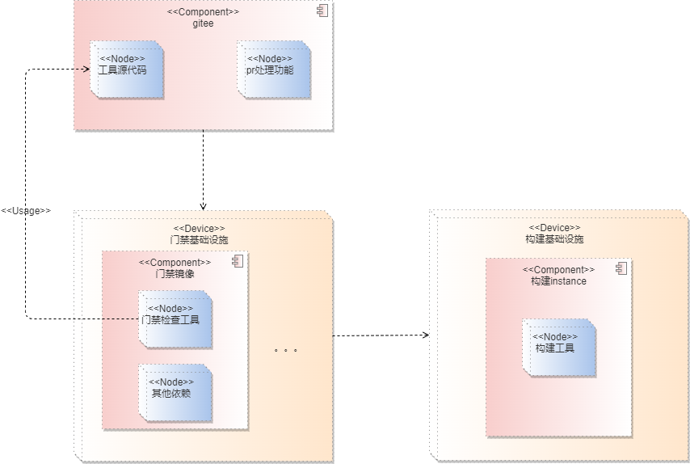

## 三、接口列表

### 3.1、命令行接口

####  3.1.1、单包/多包编译 

**build：**

| 参数 | 别名            | 类型   | 是否必须 | 说明                                                         |
| ---- | --------------- | ------ | -------- | ------------------------------------------------------------ |
| -pr  | --pull-request  | string | 是       | pull request的完整url，用于下载软件包，拼接测试工程地址。    |
| -tb  | --target-branch | string | 是       | pull request的目标分支，用于拉取软件包到测试工程。           |
| -a   | --arch          | string | 是       | 软件包编译环境的架构，用于结果查询。                         |
|      | --no-multiple   | bool   | 否       | 是否为多包编译，用于区分单包编译和多包编译。                 |
| -p   | --packages      | list   | 否       | 需要验证编译的包列表，可不传，不传时读取结果文件获取需要验证的包列表。 |
|      | --no-ignore     | bool   | 否       | 是否忽略多包验证结果，当评论/ignore_recursive时生效          |

**结果文件追加：**

**单包编译：**

```json
{
    "repo_name": "xxx",
    "project_name": "xxx",
    "single_build_result": {
        "build_detail": [
            {
                "arch": "aarch64",
                "result": "success",
                "log_url": "https://xxx/standard_aarch64/aarch64",
                "build_time": 100
            },
            {
                "arch": "x86_64",
                "result": "failed",
                "log_url": "https://xxx/standard_x86_64/x86_64",
                "build_time": 100
            }
        ],
        "current_result": "failed"
    },
    "execution_progress": { //单包编译时为追加，后面步骤为修改
        "current_progress": "single_build_check",
        "next_progress": [
            "single_install_check",
            "compare_check",
            "multi_build_check",
            "multi_install_check"
        ]
    }
}
```

**多包编译：**

```
{
    "multi_build_result": {
        "build_detail": {
            "rpmA": {
                "build_result": "success",
                "log_url": "xxx",
                "sig": "Application",
                "commitor": {
                    "name": "xxx",
                    "email": "xxx@hauwei.com"
                }
            },
            "rpmB": {
                "build_result": "success",
                "log_url": "yyy",
                "sig": "Application",
                "commitor": {
                    "name": "yyy",
                    "email": "yyy@hauwei.com"
                }
            }
        },
        "current_result": "failed/ignore/success"
    },
    "execution_progress": { //修改
        "current_progress": "multi_build_check",
        "next_progress": [
            "multi_install_check"
        ]
    }
}
```

**命令行执行结果：**

| 返回值 | 说明                                  |
| ------ | ------------------------------------- |
| 0      | 执行成功，current_result结果为success |
| 1      | 执行失败，current_result结果为failed  |

#### 3.1.2、单包/多包安装

**install：**

| 名称 | 别名            | 类型   | 是否必须 | 说明                                                         |
| ---- | --------------- | ------ | -------- | ------------------------------------------------------------ |
| -pr  | --pull-request  | string | 是       | pull request的完整url，用于拼接测试工程地址，下载软件包。    |
| -tb  | --target-branch | string | 是       | pull request的目标分支，用于配置repo。                       |
| -a   | --arch          | string | 是       | 软件包安装环境的架构，用于下载软件包的结果输出。             |
|      | --no-multiple   | bool   | 否       | 是否为多包安装，用于区分单包安装和多包安装。                 |
| -p   | --packages      | list   | 否       | 需要安装验证的包列表，可不传，不传时读取结果文件获取需要验证的包列表。 |
|      | --no-ignore     | bool   | 否       | 是否忽略多包验证结果，当评论/ignore_recursive时生效。        |

**结果文件追加：**

**单包安装：**

```json
{
    "single_install_result": {
        "install_detail": [
            {
                "arch": "aarch64",
                "result": "success",
                "log_url": "xxx", //这个可能是文件服务器中文件地址.
                "install_time": 100
            },
            {
                "arch": "x86_64",
                "result": "success",
                "log_url": "xxx", //这个可能是文件服务器中文件地址.
                "install_time": 100
            }
        ],
        "current_result": "failed"
    },
    "execution_progress": { //修改
        "current_progress": "single_install_check",
        "next_progress": [
            "compare_check"
            "multi_build_check",
            "multi_install_check"
        ]
    }
}
```

**多包安装：**

```
{
    "multi_install_result": {
        "install_detail": {
            "rpmA": {
                "install_result": "success",
                "log_url": "xxx",
                "sig": "Application",
                "commitor": {
                    "name": "xxx",
                    "email": "xxx@hauwei.com"
                }
            },
            "rpmB": {
                "install_result": "success",
                "log_url": "yyy",
                "sig": "Application",
                "commitor": {
                    "name": "yyy",
                    "email": "yyy@hauwei.com"
                }
            }
        },
        "current_result": "failed/ignore/success"
    },
    "execution_progress": { //修改
        "current_progress": "multi_install_check",
        "next_progress": []
    }
}
```

**命令行执行结果：**

| 返回值 | 说明                                  |
| ------ | ------------------------------------- |
| 0      | 执行成功，current_result结果为success |
| 1      | 执行失败，current_result结果为failed  |

#### 3.1.3、变更内容分析

**analysis：**

| 名称 | 别名        | 类型   | 是否必须 | 说明                                                   |
| ---- | ----------- | ------ | -------- | ------------------------------------------------------ |
| -df  | --diff-file | string | 否       | oecp的执行结果文件路径，用于分析变更内容，查询被依赖。 |

**结果文件追加：**

```
{
    "diff_analysis": {
        "effect_detail": {
            "rpm1": {
                "be_build_depended": [
                    "rpmA",
                    "rpmB"
                ],
                "be_install_depended": [
                    "rpmC"
                ]
            },
            "rpm2": {
                "be_build_depended": [
                    "rpmA",
                    "rpmB"
                ],
                "be_install_depended": [
                    "rpmC"
                ]
            },
            "need_verify": true
        },
        "execution_progress": { //修改
            "current_progress": "compare_check",
            "next_progress": [
                "multi_build_check",
                "multi_install_check"
            ]
        }
    }
}
```

**命令行执行结果：**

| 返回值 | 说明                                |
| ------ | ----------------------------------- |
| 0      | 无需验证，need_verify结果为false    |
| 1      | 需要继续验证，need_verify结果为true |

#### 3.1.4、pr关联管理

**link：**

| 名称 | 别名           | 类型   | 是否必须 | 说明                                                         |
| ---- | -------------- | ------ | -------- | ------------------------------------------------------------ |
| -pr  | --pull-request | string | 是       | 需要和其他pr关联的原始pr。                                   |
| -tpr | --target-pr    | string | 是       | 需要关联的目标pr。                                           |
| -b   | --behavior     | string | 是       | 关联动作，包括："link"（关联）, "verify"（查询）, "delete"（删除） |

**结果文件追加：**

```
{
    "pr_link_reult": {
        "link_pr": [
            "pr1"
        ],
        "be_link_pr": [
            "pr3",
            "pr4"
        ],
        "current_result": "success",
        "operation_meseage": "关联成功/目标已关闭/删除失败"
    }
}
```

#### 3.1.5、评论

**comment：**

| 名称 | 别名      | 类型   | 是否必须 | 说明                                                 |
| ---- | --------- | ------ | -------- | ---------------------------------------------------- |
| -m   | --message | string | 否       | 需要评论的内容，不指定时解析结果文件去拼接评论内容。 |
| -u   | --users   | list   | 否       | 需要@的用户。                                        |

**命令行执行结果：**

| 返回值 | 说明     |
| ------ | -------- |
| 0      | 评论成功 |
| 1      | 评论失败 |

### 3.2 关键模块接口

#### 3.2.1 软件包变更分析

**函数名：** diff_analysis()

**入参：**

| 参数名称    | 参数类型 | 是否必须               | 参数说明                                                     |
| ----------- | -------- | ---------------------- | ------------------------------------------------------------ |
| result_file | str      | 否（可直接使用配置项） | oecp会完全对接门禁，将对比结果保存在该文件中，该函数需要分析对比结果，输出是否需要进一步分析和验证内容。 |

**出参：**

| 参数名称         | 参数类型 | 说明                                                         |
| ---------------- | -------- | ------------------------------------------------------------ |
| need_analysis    | bool     | 是否需要验证变更影响。                                       |
| analysis_content | dict     | 分析oecp执行生成的结果，解析出需要分析的变更内容（rpm，组件，接口调用关系）。 |

**示例：**

```json
{
    "need_analysis": true,
    "analysis_content": {
        "rpmA": { //变更的二进制包
            "changed_provides": [//变更包中变更的组件，不为空时使用该字段查被依赖，为空时使用rpmA查询。
                "componment1",
                "componment2"
            ], 
            "abi_change_effect": [// 该列表不区分编译和安装，通过provides或者rpmA区分后验证，查不到的验证编译。
                "rpm1",
                "rpm2",
                "rpm3"
            ] 
        },
        "rpmB": {
            "changed_provides": [
                "componment3",
                "componment4"
            ],
            "abi_change_effect": [
                "rpm1",
                "rpm2",
                "rpm3"
            ]
        }
    }
}
```

#### 3.2.2 数据拼接

**函数名：**data_ concatenation()

**入参：**

| 参数名称    | 参数类型 | 是否必须             | 参数说明                   |
| ----------- | -------- | -------------------- | -------------------------- |
| result_file | str      | 否（可直接使用常量） | 前置检查结果保存的文件路径 |

**出参：**

| 参数名称              | 参数类型   | 参数说明                                                     |
| :-------------------- | ---------- | ------------------------------------------------------------ |
|                       |            |                                                              |
| project_name          | str        | 编译工程链接                                                 |
| single_build_result   | list(dict) | 单包编译结果                                                 |
| single_install_result | list(dict) | 单包安装结果                                                 |
| depended_result       | dict       | 被依赖的软件包，软件包验证结果/日志，软件包维护信息          |
| test_guide            | str        | 自验证指导说明，如果太多需使用链接                           |
| pr_link_reult         | dict       | pr关联数据                                                   |
| execution_progress    | dict       | 执行进度，包含当前步骤和剩余步骤。每个步骤都有对应格式的回显内容。 |

**示例：**

```json
{
    "repo_name": "xxx",
    "project_name": "xxx",
    "single_build_result": {
        "build_detail": [
            {
                "arch": "aarch64",
                "result": "success",
                "log_url": "https://xxx/standard_aarch64/aarch64",
                "build_time": 100
            },
            {
                "arch": "x86_64",
                "result": "failed",
                "log_url": "https://xxx/standard_x86_64/x86_64",
                "build_time": 100
            }
        ],
        "current_result": "failed"
    },
    "single_install_result": {
        "install_detail": [
            {
                "arch": "aarch64",
                "result": "success",
                "log_url": "xxx", //这个可能是文件服务器中文件地址.
                "install_time": 100
            },
            {
                "arch": "x86_64",
                "result": "success",
                "log_url": "xxx", //这个可能是文件服务器中文件地址.
                "install_time": 100
            }
        ],
        "current_result": "failed"
    },
    "diff_analysis": {
        "effect_detail": {
            "rpm1": {
                "be_build_depended": [
                    "rpmA",
                    "rpmB"
                ],
                "be_install_depended": [
                    "rpmC"
                ]
            },
            "rpm2": {
                "be_build_depended": [
                    "rpmA",
                    "rpmB"
                ],
                "be_install_depended": [
                    "rpmC"
                ]
            },
            "need_verify": true
        },
        "multi_build_result": {
            "build_detail": {
                "rpmA": {
                    "build_result": "success",
                    "log_url": "xxx",
                    "sig": "Application",
                    "commitor": {
                        "name": "xxx",
                        "email": "xxx@hauwei.com"
                    }
                },
                "rpmB": {
                    "build_result": "success",
                    "log_url": "yyy",
                    "sig": "Application",
                    "commitor": {
                        "name": "yyy",
                        "email": "yyy@hauwei.com"
                    }
                }
            },
            "current_result": "failed"
        },
        "multi_install_result": {
            "install_detail": {
                "rpmA": {
                    "install_result": "success",
                    "log_url": "xxx",
                    "sig": "Application",
                    "commitor": {
                        "name": "xxx",
                        "email": "xxx@hauwei.com"
                    }
                },
                "rpmB": {
                    "install_result": "success",
                    "log_url": "yyy",
                    "sig": "Application",
                    "commitor": {
                        "name": "yyy",
                        "email": "yyy@hauwei.com"
                    }
                }
            },
            "current_result": "failed"
        },
        "test_guide": "xxxx",
        "pr_link_reult": {
            "link_pr": [
                "pr1"
            ],
            "be_link_pr": [
                "pr3",
                "pr4"
            ],
            "current_result": "success",
            "operation_meseage": "关联成功/目标已关闭/删除失败"
        },
        "execution_progress": { //单包编译时为追加，后面步骤为修改
            "current_progress": "single_build_check",
            "next_progress": [
                "single_install_check",
                "compare_check",
                "multi_build_check",
                "multi_install_check"
            ]
        }
    }
```

**执行步骤对应回显信息：**

```json
{
    "single_build_check": "xxx",
    "single_install_check": "xxx",
    "compare_check": "xxx",
    "multi_build_check": "xxx",
    "multi_install_check": "xxx"
}
```

#### 3.2.3 关联pr

**函数名**：pull_link

**入参**：

| 参数名称  | 参数类型 | 是否必须 | 参数说明         |
| --------- | -------- | -------- | ---------------- |
| pr_number | str      | 是       | 提交的pr号       |
| target_pr | str      | 是       | 待关联的目标pr号 |

**出参**：

| 参数名称    | 参数类型 | 说明                         |
| ----------- | -------- | ---------------------------- |
| link_result | str      | 关联的结果（success/failed） |
| detail      | str      | 详细信息                     |

**示例**：

```shell
{
    "link_result":"success/failed",
    "detail":"目标已合入"
}
```

#### 3.2.4 pr关联关系验证/查询

**函数名**：relation_verify

**入参**：

| 参数说明  | 参数类型 | 是否必须 | 参数说明   |
| --------- | -------- | -------- | ---------- |
| pr_number | str      | 是       | 待查询的pr |

**出参**：

| 参数说明   | 参数类型 | 说明       |
| ---------- | -------- | ---------- |
| link_pr    | str      | 关联的pr   |
| be_link_pr | str      | 被关联的pr |

**示例**：

```shell
{
    "link_pr":{
        "pr_number1":"state",
        "pr_number2":"state"
    },
    "be_link_pr":{
        "pr_number1":"state",
        "pr_number2":"state"
    }
}
```

#### 3.2.5 删除关联pr

**函数名**：del_pull_link

**入参**：

| 参数名称    | 参数类型 | 是否必须 | 参数说明           |
| ----------- | -------- | -------- | ------------------ |
| pr_number   | str      | 是       | 提交的pr           |
| will_del_pr | str      | 是       | 将要被删除关联的pr |

**出参**：

| 参数名称 | 参数类型 | 说明                         |
| -------- | -------- | ---------------------------- |
| result   | str      | 删除的结果（success/failed） |
| detail   | str      | 详细信息                     |

**示例**：

```shell
{
    "result":"success/failed",
    "detail":"关联关系不存在"
}
```

#### 3.2.6 拉取合并pr

**函数名**：fetch_pull

**入参**:

| 参数名称  | 参数类型 | 是否必须 | 参数说明            |
| --------- | -------- | -------- | ------------------- |
| url       | str      | 是       | 仓库地址            |
| pr_number | str      | 是       | pr号                |
| depth     | int      | 否       | 获取的深度，默认为1 |

**出参**：

| 参数名称 | 参数类型 | 说明                           |
| -------- | -------- | ------------------------------ |
| result   | str      | 合并pr的结果（success/failed） |
| detail   | str      | 详细信息                       |

**示例**：

```shell
{
    "result":"success/failed",
    "detail":""
}
```

#### 3.2.7 递归检查开关

**函数名**：depend_analyes_stop

**入参**：

| 参数名称       | 参数类型 | 是否必须 | 参数说明           |
| -------------- | -------- | -------- | ------------------ |
| adjust_abi_rpm | str      | 是       | abi发生变更的rpm包 |
| pr_number      | str      | 是       | 提交的pr           |

**出参**：

| 参数名称 | 参数类型 | 说明       |
| -------- | -------- | ---------- |
| result   | str      | 开关的结果 |
| detail   | str      | 详情信息   |

**示例**：

```shell
{
    "result":"success/failed",
    "detail":""
}
```

#### 3.2.8 软件包维护人员

**函数名**：package_committer

**入参**：

| 参数名        | 参数类型 | 是否必传 | 参数说明   |
| ------------- | -------- | -------- | ---------- |
| package_names | list     | 是       | 软件包名称 |

**出参**：

| 参数名称     | 参数类型 | 说明       |
| ------------ | -------- | ---------- |
| package_name | str      | 软件包名称 |
| email        | str      | email地址  |
| id           | str      | gitee_id   |

**示例**：

```json
[
    {"package_name":"xxxxx1",
     "email": "xxxxxxx1",
     "id": "xxxxxx1"},
   {"package_name":"xxxxx2",
     "email": "xxxxxxx2",
     "id": "xxxxxx2"}
]
```


#### 3.2.9 单包编译

**请求参数：**

| 参数名称     | 参数类型 | 是否必须 | 参数说明                   |
| ------------ | -------- | -------- | -------------------------- |
| pr_url       | string   | 是       | pr链接，包含新软件包信息。 |
| package_path | String   | 是       | 在本地存储的新包路径       |

**出参：**

| 参数名称     | 参数类型 | 是否必须 | 参数说明                                        |
| ------------ | -------- | -------- | ----------------------------------------------- |
| package_name | string   | 是       |                                                 |
| build_result | String   | 是       | 在本地存储的新包路径                            |
| project_name | String   | 是       | 编译用的obs工程的名称（根据pr号及包名拼接获得） |
| project_url  | String   | 是       | 编译用的obs工程的链接                           |
| state        | String   | 是       | 状态，如果两个工程都为成功显示状态成功          |
| log_url      | String   | 是       | 日志链接                                        |


**请求返回体：**

```json
{
    "package_name": "python3-mock",
    "build_result": [
        {
            "arch": "aarch64",
            "result": "success",
            "log_url": "https://xxx/standard_aarch64/aarch64",
            "build_time": 100
        },
        {
            "arch": "x86_64",
            "result": "failed",
            "log_url": "https://xxx/standard_x86_64/x86_64",
            "build_time": 100
        }
    ],
    "project_name": "openEuler:test_ci",
    "project_url": "",
    "state": "",
    "log_url": "",
}


```

#### 3.2.10 多包编译

**入参：**

| 参数名称    | 参数类型 | 是否必须 | 参数说明         |
| ----------- | -------- | -------- | ---------------- |
| depend_list | List     | 是       | 编译依赖包名列表 |

**出参：**

| 参数名称    | 参数类型 | 是否必须 | 参数说明           |
| ----------- | -------- | -------- | ------------------ |
| result_list | List     | 是       | 编译依赖包查询结果 |

```json
{
    "result_list": [
        {
            "package_name": "ansible",
            "build_result": [
                {
                    "arch": "aarch64",
                    "result": "success",
                    "log_url": "https://xxx/standard_aarch64/aarch64",
                    "build_time": 100
                },
                {
                    "arch": "x86_64",
                    "result": "failed",
                    "log_url": "https://xxx/standard_x86_64/x86_64",
                    "build_time": 100
                }
            ]
        },
        {
            "package_name": "cloud_init",
            "build_result": [
                {
                    "arch": "aarch64",
                    "result": "success",
                    "log_url": "https://xxx/standard_aarch64/aarch64",
                    "build_time": 100
                },
                {
                    "arch": "x86_64",
                    "result": "failed",
                    "log_url": "https://xxx/standard_x86_64/x86_64",
                    "build_time": 100
                }
            ]
        }
    ]
}
```


#### 3.2.11 单包/多包安装

**请求参数：**

| 参数名称     | 参数类型 | 是否必须 | 参数说明 |
| ------------ | -------- | -------- | -------- |
| Install_list | list     | 是       | 安装列表 |

**参数：**

| 参数名称       | 参数类型 | 是否必须 | 参数说明 |
| -------------- | -------- | -------- | -------- |
| install_result | list     | 是       | 安装结果 |

```json
{
    "install_result": [
        {
            "name": "pkgship",
            "state": "success",
            "result": [
                {
                    "arch": "standard_x86",
                    "state": "success",
                    "log_url": "xxx",
                    "install_time": 100
                },
                {
                    "arch": "standard_aarch64",
                    "state": "success",
                    "log_url": "xxx",
                    "install_time": 100
                }
            ]
        },
        {
            "name": "python3-pytest-shutil",
            "state": "success",
            "result": [
                {
                    "arch": "standard_x86",
                    "state": "success",
                    "log_url": "xxx",
                    "install_time": 100
                },
                {
                    "arch": "standard_aarch64",
                    "state": "success",
                    "log_url": "xxx",
                    "install_time": 100
                }
            ]
        }
    ]
}
```

#### 3.2.12 软件包被依赖分析

**请求参数：**

| 参数名称         | 参数类型 | 是否必须 | 参数说明     |
| ---------------- | -------- | -------- | ------------ |
| Package_name     | string   | 是       | 软件包名     |
| analysis_content | Dict     | 是       | oecp执行结果 |

**出参：**

| 参数名称           | 参数类型 | 是否必须 | 参数说明                       |
| ------------------ | -------- | -------- | ------------------------------ |
| build_dependency   | list     | 是       | 将oecp的结果解析，找到编译依赖 |
| install_dependency | list     | 是       | 将oecp的结果解析，找到安装依赖 |

```json
{
    "package_name": "python3-mock",
    "build_dependency": [
        "ansible",
        "cloud-init"
    ],
    "install_dependency": [
        "pkgship",
        "python3-pytest-shutil"
    ],
  
}

```


## 四、附件

### 1、详细流程图

**影响编译：**

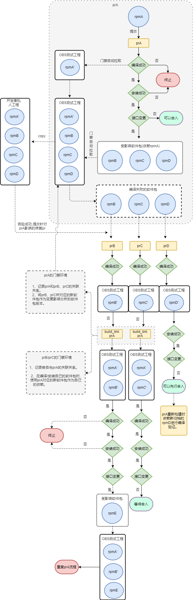


**影响安装：**

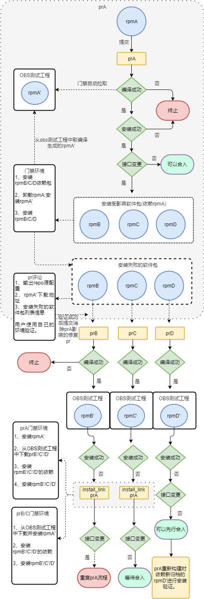

**说明：**

**pr关联机制：被影响的软件包去link源软件包**

- 假设rpmA的修改prA导致rpmB、rpmC、rpmD编译/安装失败，rpmB、rpmC、rpmD分别提交prB、prC、prD去修复该影响；
- 若修复的pr如prD前向兼容旧rpmA，那prD门禁可能直接成功，此时可根据OBS测试工程中rpmD‘的状态先行合入prD。
- 若修复的pr如prB和prC需要依赖prA的修改内容才能成功，在**prB、prC中分别评论/build_link prA或者/install_link prA**，此时后台文件服务器或者数据库会记录prB、prC和prA的关联关系，**并在prA的评论中显示prB、prC已经与其关联。**

- 在各pr的门禁中，将会**把与自己有关联关系的pr同步到编译/安装环境中**，替换原有的软件包。


- prA、prB、prC任何一个**pr关闭或者合入**，将会在门禁文件服务器或者数据库中**删除与该pr相关的关联关系**。

### 2、功能点

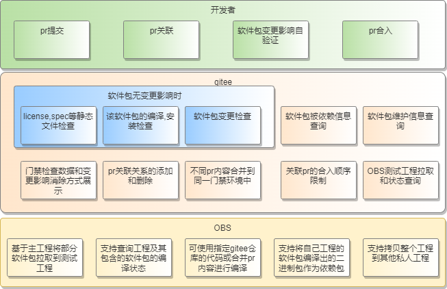


## 五、遗留问题：

**新：**

1、新建仓的pr如何创建测试工程。

单包编译时，要查询目标工程（n个）是否已经包含该包。如果没有，新建测试工程。

2、pr关联后测试工程如何处理。

**编译：**

1、pr关联之后，重新触发门禁，单包和多包编译之前需要查询当前pr的关联关系，将关联的pr和被关联的pr中的新包拉取到测试工程。

2、多包编译之前需要将被依赖包删除掉，重新拉取，防止被依赖包更新在测试工程中识别不到。

**安装：**

1、pr关联之后，重新触发门禁，单包和多包安装之前需要查询当前pr的关联关系，将关联的pr和被关联的pr中的新包下载到本地进行安装验证。

3、安装不涉及环境重用，无需进行清理？如果需要验证的包已经安装了，该怎么删除？

